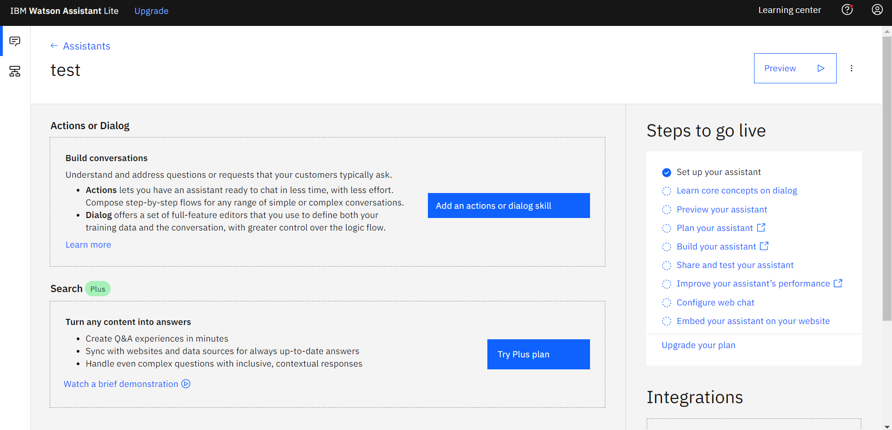
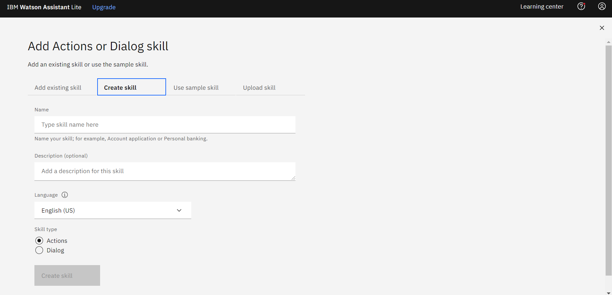
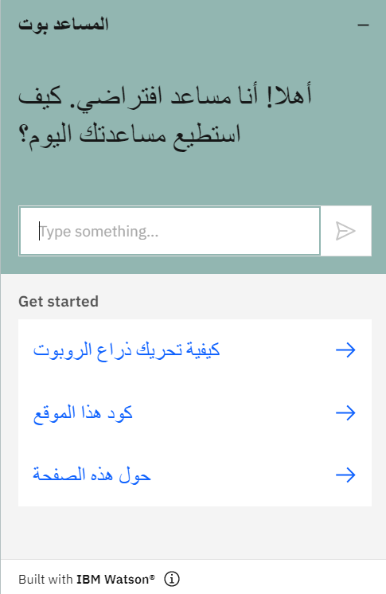

# chat-bot

<!-- PROJECT IMAGE -->

<!-- TABLE OF CONTENTS -->
## Table of Contents

* [Abstract](#Abstract)
* [How to use IBM Watson](#how-to-use-ibm-watson)
* [Design](#design)
    * [Intent & Entity](#intent-&-entity)
    * [UI](#ui)
* [Script Code](#script-code)

<!-- ABSTRACT -->
## Abstract

This is a repository on how to use IBM Watson and shows a chat bot specially designed for the robot control web page (check it <a href="https://github.com/MohammedAlosaimi/robot-control">here</a>). In this repository, a chat bot has been designed for both languages ​​(Arabic and English) in order to facilitate communication between the user and the chat bot.

<!-- HOW TO USE IBM WATSON -->
## How to use IBM Watson

To start using IBM Watson you need to create an <a href="https://www.ibm.com/cloud/watson-assistant?cm_sp=Scheduler-_-CopyChng2-_-C">IBM Watson</a> account by clicking on "get started free"(see figure 1), Or you can go directly to the registration page by clicking <a href="https://cloud.ibm.com/registration?target=/developer/watson/launch-tool/conversation&hideTours=true&cm_sp=WatsonPlatform-WatsonPlatform-_-OnPageNavCTA-IBMWatson_Conversation-_-Watson_Developer_Website&cm_mmca1=000027BD">here.</a> (figure 2)

    

        figure 1: IBM Watson.
    

     

    
    

        figure 2: IBM Watson registration page.
    

After filling out the form with your data, you will see the main page of your account, go to the "Assistants" (if you are not already there). Then click "Create Assistant" to create a new assistant (see figure 3). 

    

        figure 3: Create Assistant.
    

Give the assistant any name you want, then click "Create Assistant"(figure 4). Then this page will appear (figure 5).

    

        figure 4: Assistant Name.
    

     

    
    

        figure 5: Assistant  page.
    

To add a skill to your assistant, click on "Add an actions or doalog skill"(figure 5), you will see this page(figure 6), click on "Create Skill"(If you don't already have a skill). Then add a name for the skill and select the language you want from "Language". You can specify whether this task is an action type or a dialog type. In this example, we'll only use the dialog type. After filling in the data, click "Create skill" (figure 6).

    

        figure 6: Create Skill.
    

After creating the skill, this page will appear (figure 7), click on the task you created. Then you'll see this page (figure 8).

    

        figure 7: Skill.
    

     

    
    

        figure 8: Skill main page.
    

To create intents click on "Create inrent" (figure 8). On this page (figure 9), you can list the words expected from the user in one group with a specially name. for instance, Look at Figure 10, If the user enters (hi, hallo, or hello) it will be under the welcome intent. You can add more words expected from the user through "User example".

    

        figure 9: Create intent.
    

     

    
    

        figure 10: Example for intent.
    

To add an intent in dialog. You can add an intent to an existing node or create a new node by clicking on “Add node” (figure 11). After adding a node, you can name the node with the name you want in the "Enter node name" box, and in order to associate these node with a intent, click on "Enter condition" and then enter "#" and you will find the intent you created, click on it (figure 12). In "Assistant responds" you can specify the type of response you want (text, image, option, etc.). In this example (Figure 13), if the user enters one of the words expected from the user that is in the "welcome" intent, the response will be "Hi, how can I help you?".

    

        figure 11: Dialog.
    

     

    
    

        figure 12: Add intent to the node.
    

     

    
    

        figure 13: Example for node.
    

Entity is another feature to list the similar words into a specific value. For instance, we will create an "Food" entity (figure 14). This entity contain two values ​​(Vegetable and Fruit). If the user enters cucumber or lettuce, the value will be vegetable, and if he enters an orange or apple, the value will be fruit (figure 15, 16 & 17). You can also use this entity in node.

    

        figure 14: Food Entity.
    

     

    
    

        figure 15: Vegetable Value.
    

     

    
    

        figure 16: Fruit Value.
    

     

    
    

        figure 17: Example for food entity.
    

You can download this assistant as a JSON file (figure 18), Or you can copy and paste the script code on your web page by clicking "Integrate web chat" in the "Integrations" box (figure 18). You will see this page (Figure 19), name the web chat with any name and then click on Create. This will show you a page (Figure 20) which contains many properties (such as colors, assistant name, get start, etc.). To copy the script code, go to "Embed" and you will find the code there (Figure 21). Note: If you make any changes, be sure to click "Save and exit" after you're done

    

        figure 18: Download JSON file.
    

     

    
    

        figure 19: Integration Name.
    

     

    
    

        figure 20: Web chat page.
    

     

    
    

        figure 21: Script code(Embed page).
    

<!-- DESIGN -->
## Design

<!-- INTENT & ENTITY -->
### Intent & Entity

Both languages(Arabic & English) ​​have the same intents with a slight difference in the words expected from the user (figure 22 & 23).

    

        figure 22: Emglish intent.
    

     

    
    

        figure 23: Arabic intent.
    

As for the dialog, every node has a special intent. You can see the dialog for both English and Arabic(figure 24 & 25).

    

        figure 24: Emglish dialog.
    

     

    
    

        figure 25: Arabic dialog.
    

<!-- UI -->
### UI

This section displays the user interface of both languages(figure 26 & 27). You can change between the two languages ​​by clicking on one of the two languages ​​(Fig. 28)

    figure 26: English UI.

 

    figure 27: Arabic UI.

 

    
     
    figure 28: Language button

<!-- SCRIPT CODE -->
## Script Code
This
